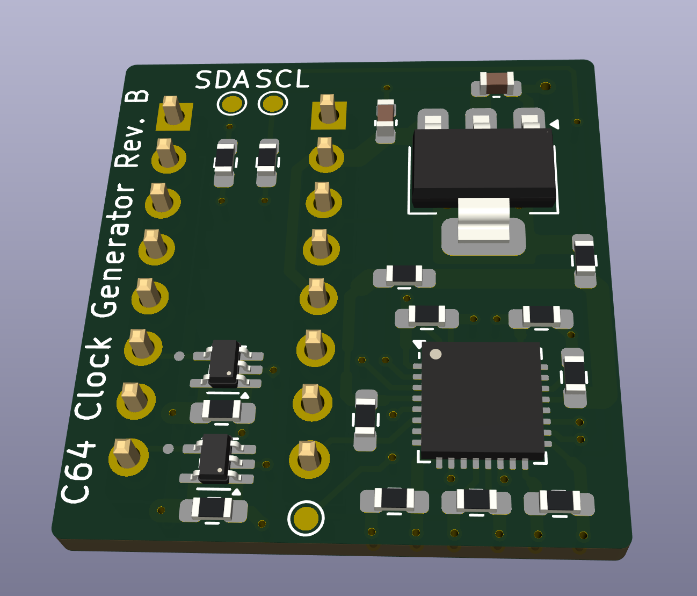

# C64 Clock Generator
## Introduction
This is a replacement for the MOS 8701 clock generator IC used in C64 board revisions 250425-01 and later.
It's not a 1:1 replica but the generated clocks follow more strictly the PAL specification.
MOS 8701 is a simple PLL which generates two clocks using a 17.734475 MHz XTAL oscillator. These clocks are:
- Color clock using directly the oscillator frequency of 17.734475 MHz
- Dot clock ("pixel clock") running at 7.8882 MHz

The Dot clock is generated by multiplying the color clock by 4 and divide by 9: 

$`\frac{17.734475MHz * 4}{9} = 7.8882MHz`$

Furthermore, VIC divides the dot clock by 8 (as one character consists of 8 pixel and memory access is character based) which gives the $`\phi0`$ clock of 0.986025MHz which is also the resulting CPU and VIC frequency. This is where C64 violates the PAL standard: One raster line is made of 63 CPU/VIC cycles which gives a duration of

$`\frac{1}{0.986025MHz}*63 = 63.8929us`$

However, PAL defines the horizontal/line frequency as 15.625kHz which is 64us. So C64 is off here by 

$`1-\frac{63.8929us}{64us} = 1.676\%`$

On old CRT screens this isn't really an issue as they make use of the synchronization pulses within the video signal. However, modern LCD screens (which perform internal AD conversion of the video signal) are quite strict on these tolerances and produce screen artifacts in case frequency deviation becomes too big. In particular, Samsung based models need an exact ratio between the color frequency of the video signal and the horizontal/vertical line/screen frequency as defined by PAL. While C64 precisely implements the color frequency of 4.43361875 MHz (which is the 17.734475 MHz color clock divided by 4) the line/screen frequency and with that the overall ratio is off.

## Design
{:width="400px"}
This clock generator uses a the IDT5V49EE902 programable clock generator from Renasas to generate the required clocks. This IC has a built-in EEPROM to store the configuration, i.e. an extra microcontroller is not needed for operation (but required for initial programming). The integrated XTAL oscillator uses the existing 17.734475 MHz XTAL on the C64 board, so only MOS 8701 needs to be replaced. The color clock is directly generated by this oscillator while the dot clock is created using frequency synthesis and the included PLL. The PLL output frequency is configured to 425.25 MHz which is fed into an output divider of ratio 54. The output frequency based on input frequency is defined as:

$`f_{out} = f_{in} * \frac{M}{D} * Q`$

where M and D are the PLL loop dividers and Q is the output divider. With M = 1127, D = 47 and Q = 54 we get the following dot clock for an input frequency of 17.734475 MHz:

$`f_{out} = 17.734475MHz * \frac{1127}{47} * 54 = 7.875MHz`$

This results in a line frequency of

$`f_{line} =  \frac{7.875MHz}{8} / 63 = 15.625kHz`$

## Programming the IDT5V49EE902
The python script in `pll/prog.py` contains the programming sequence for the IDT5V49EE902 using I2C. The script can be executed on a Raspberry Pi Pico running MicroPython (https://www.raspberrypi.com/documentation/microcontrollers/micropython.html). Porting it to another MicroController or a USB to I2C bridge should be easily possible. The C64 Clock Generator Board has two I2C testpads exposed with on board pull-up resistors.
